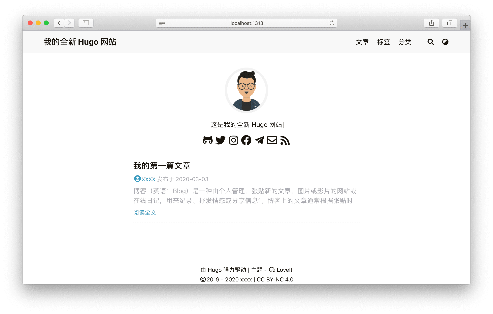

探索 Hugo - **FeelIt** 主題的全部內容和背後的核心概念.

<!--more-->

## 1 準備

由於 Hugo 提供的便利性, [Hugo](https://gohugo.io/) 本身是這個主題唯一的依賴.

直接安裝滿足你操作系統 (**Windows**, **Linux**, **macOS**) 的最新版本 [:(far fa-file-archive fa-fw): Hugo (> 0.84.0)](https://gohugo.io/getting-started/installing/).


由於 [Markdown 渲染鉤子函數](https://gohugo.io/getting-started/configuration-markup#markdown-render-hooks) 在 [Hugo 聖誕節版本](https://gohugo.io/news/0.62.0-relnotes/) 中被引入 一些圖像資源使用的是[0.84.0](https://github.com/gohugoio/hugo/releases/tag/v0.84.0)中引入的webp, 本主題只支持高於 **0.84.0** 的 Hugo 版本.



由於這個主題的一些特性需要將 :(fab fa-sass fa-fw): SCSS 轉換為 :(fab fa-css3 fa-fw): CSS, 推薦使用 Hugo **extended** 版本來獲得更好的使用體驗.


## 2 安裝

以下步驟可幫助你初始化新網站. 如果你根本不了解 Hugo, 我們強烈建議你按照此 [快速入門文檔](https://gohugo.io/getting-started/quick-start/) 進一步了解它.

### 2.1 創建你的項目

Hugo 提供了一個 `new` 命令來創建一個新的網站:

```bash
hugo new site my_website
cd my_website
```

### 2.2 安裝主題

**FeelIt** 主題的倉庫是: [https://github.com/khusika/FeelIt](https://github.com/khusika/FeelIt).

你可以下載主題的 [最新版本 :(far fa-file-archive fa-fw): .zip 文件](https://github.com/khusika/FeelIt/releases) 並且解壓放到 `themes` 目錄.

另外, 也可以直接把這個主題克隆到 `themes` 目錄:

```bash
git clone https://github.com/khusika/FeelIt.git themes/FeelIt
```

或者, 初始化你的項目目錄為 git 倉庫, 並且把主題倉庫作為你的網站目錄的子模塊:

```bash
git init
git submodule add https://github.com/khusika/FeelIt.git themes/FeelIt
```

### 2.3 基礎配置 {#basic-configuration}

以下是 FeelIt 主題的基本配置:

```toml
baseURL = "http://example.org/"
# [en, zh-cn, fr, ...] 設置默認的語言
defaultContentLanguage = "zh-cn"
# 網站語言, 僅在這里 CN 大寫
languageCode = "zh-CN"
# 是否包括中日韓文字
hasCJKLanguage = true
# 網站標題
title = "我的全新 Hugo 網站"

# 更改使用 Hugo 構建網站時使用的默認主題
theme = "FeelIt"

[params]
  # FeelIt 主題版本
  version = "1.0.X"

[menu]
  [[menu.main]]
    identifier = "posts"
    # 你可以在名稱 (允許 HTML 格式) 之前添加其他信息, 例如圖標
    pre = ""
    # 你可以在名稱 (允許 HTML 格式) 之後添加其他信息, 例如圖標
    post = ""
    name = "文章"
    url = "/posts/"
    # 當你將鼠標懸停在此菜單鏈接上時, 將顯示的標題
    title = ""
    weight = 1
  [[menu.main]]
    identifier = "tags"
    pre = ""
    post = ""
    name = "標簽"
    url = "/tags/"
    title = ""
    weight = 2
  [[menu.main]]
    identifier = "categories"
    pre = ""
    post = ""
    name = "分類"
    url = "/categories/"
    title = ""
    weight = 3

# Hugo 解析文檔的配置
[markup]
  # 語法高亮設置 (https://gohugo.io/content-management/syntax-highlighting)
  [markup.highlight]
    # false 是必要的設置 (https://github.com/khusika/FeelIt/issues/158)
    noClasses = false
```


在構建網站時, 你可以使用 `--theme` 選項設置主題. 但是, 我建議你修改配置文件 (**config.toml**) 將本主題設置為默認主題.


### 2.4 創建你的第一篇文章

以下是創建第一篇文章的方法:

```bash
hugo new posts/first_post.md
```

通過添加一些示例內容並替換文件開頭的標題, 你可以隨意編輯文章.


默認情況下, 所有文章和頁面均作為草稿創建. 如果想要渲染這些頁面, 請從元數據中刪除屬性 `draft: true`, 設置屬性 `draft: false` 或者為 `hugo` 命令添加 `-D`/`--buildDrafts` 參數.


### 2.5 在本地啟動網站

使用以下命令啟動網站:

```bash
hugo serve
```

去查看 `http://localhost:1313`.



當你運行 `hugo serve` 時, 當文件內容更改時, 頁面會隨著更改自動刷新.



由於本主題使用了 Hugo 中的 `.Scratch` 來實現一些特性,
非常建議你為 `hugo server` 命令添加 `--disableFastRender` 參數來實時預覽你正在編輯的文章頁面.

```bash
hugo serve --disableFastRender
```


### 2.6 構建網站

當你準備好部署你的網站時, 運行以下命令:

```bash
hugo
```

會生成一個 `public` 目錄, 其中包含你網站的所有靜態內容和資源. 現在可以將其部署在任何 Web 服務器上.


網站內容可以通過 [Netlify](https://www.netlify.com/) 自動發布和托管 (了解有關[通過 Netlify 進行 HUGO 自動化部署](https://www.netlify.com/blog/2015/07/30/hosting-hugo-on-netlifyinsanely-fast-deploys/) 的更多信息).
或者, 您可以使用 [AWS Amplify](https://gohugo.io/hosting-and-deployment/hosting-on-aws-amplify/), [Github pages](https://gohugo.io/hosting-and-deployment/hosting-on-github/), [Render](https://gohugo.io/hosting-and-deployment/hosting-on-render/) 以及更多...


## 3 配置

### 3.1 網站配置 {#site-configuration}

除了 [Hugo 全局配置](https://gohugo.io/overview/configuration/) 和 [菜單配置](#basic-configuration) 之外, **FeelIt** 主題還允許您在網站配置中定義以下參數 (這是一個示例 `config.toml`, 其內容為默認值).

請打開下面的代碼塊查看完整的示例配置 :(far fa-hand-point-down fa-fw)::

```toml
[params]
  #  FeelIt 主題版本
  version = "1.0.X"
  # 網站描述
  description = "這是我的全新 Hugo 網站"
  # 網站關鍵詞
  keywords = ["Theme", "Hugo"]
  # 網站默認主題樣式 ("light", "dark", "auto")
  defaultTheme = "auto"
  # 公共 git 倉庫路徑，僅在 enableGitInfo 設為 true 時有效
  gitRepo = ""
  #  哪種哈希函數用來 SRI, 為空時表示不使用 SRI
  # ("sha256", "sha384", "sha512", "md5")
  fingerprint = ""
  #  日期格式
  dateFormat = "2006-01-02"
  # 網站圖片, 用於 Open Graph 和 Twitter Cards
  images = ["/logo.png"]
  #  是否啟用 CSS 和 JS 源映射
  SourceMap = true

  # PWA config
  [params.pwa]
    # whether to enable PWA support
    enable = true
    # service-worker version
    version = "1.0.1"

  #  應用圖標配置
  [params.app]
    # 當添加到 iOS 主屏幕或者 Android 啟動器時的標題, 覆蓋默認標題
    title = "FeelIt"
    # 是否隱藏網站圖標資源鏈接
    noFavicon = false
    # 更現代的 SVG 網站圖標, 可替代舊的 .png 和 .ico 文件
    svgFavicon = ""
    # Android 瀏覽器主題色
    themeColor = "#ffffff"
    # Safari 圖標顏色
    iconColor = "#5bbad5"
    # Windows v8-10磁貼顏色
    tileColor = "#da532c"

  #  搜索配置
  [params.search]
    enable = true
    # 搜索引擎的類型 ("lunr", "algolia")
    type = "lunr"
    # 文章內容最長索引長度
    contentLength = 4000
    # 搜索框的占位提示語
    placeholder = ""
    #  最大結果數目
    maxResultLength = 10
    #  結果內容片段長度
    snippetLength = 50
    #  搜索結果中高亮部分的 HTML 標簽
    highlightTag = "em"
    #  是否在搜索索引中使用基於 baseURL 的絕對路徑
    absoluteURL = false
    [params.search.algolia]
      index = ""
      appID = ""
      searchKey = ""

  # 頁面頭部導航欄配置
  [params.header]
    # 桌面端導航欄模式 ("fixed", "normal", "auto")
    desktopMode = "fixed"
    # 移動端導航欄模式 ("fixed", "normal", "auto")
    mobileMode = "auto"
    #  頁面頭部導航欄標題配置
    [params.header.title]
      # LOGO 的 URL
      logo = ""
      # 標題名稱
      name = ""
      # 你可以在名稱 (允許 HTML 格式) 之前添加其他信息, 例如圖標
      pre = ""
      # 你可以在名稱 (允許 HTML 格式) 之後添加其他信息, 例如圖標
      post = ""
      #  是否為標題顯示打字機動畫
      typeit = false
      #  是否顯示RSS圖標
      rss = true

  # 頁面底部信息配置
  [params.footer]
    enable = true
    #  自定義內容 (支持 HTML 格式)
    custom = ''
    #  是否顯示 Hugo 和主題信息
    hugo = true
    #  是否顯示版權信息
    copyright = true
    #  是否顯示作者
    author = true
    # 網站創立年份
    since = 2019
    # ICP 備案信息，僅在中國使用 (支持 HTML 格式)
    icp = ""
    # 許可協議信息 (支持 HTML 格式)
    license = '<a rel="license external nofollow noopener noreffer" href="https://creativecommons.org/licenses/by-nc/4.0/" target="_blank">CC BY-NC 4.0</a>'

  #  Section (所有文章) 頁面配置
  [params.section]
    # section 頁面每頁顯示文章數量
    paginate = 20
    # 日期格式 (月和日)
    dateFormat = "01-02"
    # RSS 文章數目
    rss = 10

  #  List (目錄或標簽) 頁面配置
  [params.list]
    # list 頁面每頁顯示文章數量
    paginate = 20
    # 日期格式 (月和日)
    dateFormat = "01-02"
    # RSS 文章數目
    rss = 10

  # 
  # 關於頁面配置
  [params.about]
    # 是否啟用關於頁面的配置文件
    # 依賴於取決於 .Site.Params.home.profile.enable
    enable = true
    # 是否啟用參數布局
    param = true
    # 參數布局的標題
    paramTitle = "個人信息"
    # 您網站的一般描述
    # 可以用markdown樣式寫
    description = "[FeelIt](https://github.com/khusika/FeelIt) 是一個由 [Khusika](https://khusika.com) 開發的**簡潔**、**優雅**且**高效**的 [Hugo](https://gohugo.io/) 博客主題。 它的原型基於 [LoveIt 主題](https://github.com/dillonzq/LoveIt), [LeaveIt 主題](https://github.com/liuzc/LeaveIt), 和 [KeepIt 主題](https://github.com/Fastbyte01/KeepIt)。"
    # 你的狀態描述
    [[params.about.status]]
      faIcon = "fas fa-building"
      title = "公司"
      desc = "FeelIt"
    [[params.about.status]]
      faIcon = "fas fa-briefcase fa-fw"
      title = "職業"
      desc = "自由職業者"
    [[params.about.status]]
      title = "地點"
      faIcon = "fas fa-map-marker-alt"
      desc = "地球"
    # 參數說明
    [[params.about.parameter]]
      language = "UI/UX"
      level = "80"
    [[params.about.parameter]]
      language = "HTML"
      level = "70"
    [[params.about.parameter]]
      language = "Go"
      level = "60"

  # 主頁配置
  [params.home]
    #  RSS 文章數目
    rss = 10
    # 主頁個人信息
    [params.home.profile]
      enable = true
      # Gravatar 郵箱，用於優先在主頁顯示的頭像
      gravatarEmail = ""
      # 主頁顯示頭像的 URL
      avatarURL = "/images/avatar.png"
      #  主頁顯示的網站標題 (支持 HTML 格式)
      title = ""
      # 主頁顯示的網站副標題
      subtitle = "這是我的全新 Hugo 網站"
      # 是否為副標題顯示打字機動畫
      typeit = true
      # 是否顯示社交賬號
      social = true
      #  免責聲明 (支持 HTML 格式)
      disclaimer = ""
    # 主頁文章列表
    [params.home.posts]
      enable = true
      # 主頁每頁顯示文章數量
      paginate = 6
      #  display image-preview
      imagePreview = true
      #  被 params.page 中的 hiddenFromHomePage 替代
      # 當你沒有在文章前置參數中設置 "hiddenFromHomePage" 時的默認行為
      defaultHiddenFromHomePage = false

  #  oEmbed config
  [params.oembed]
    # Privacy config (https://gohugo.io/about/hugo-and-gdpr/)
    privacy = false
    [params.oembed.facebook]
      # Facebook Aplication Identity and Client Token (<APPID>|<CLIENTTOKEN>)
      accessToken = ""
    [params.oembed.twitter]
      enableDNT = false

  # 作者的社交信息設置
  [params.social]
    GitHub = "xxxx"
    Linkedin = ""
    Twitter = "xxxx"
    Instagram = "xxxx"
    Facebook = "xxxx"
    Telegram = "xxxx"
    Medium = ""
    Gitlab = ""
    Youtubelegacy = ""
    Youtubecustom = ""
    Youtubechannel = ""
    Tumblr = ""
    Quora = ""
    Keybase = ""
    Pinterest = ""
    Reddit = ""
    Codepen = ""
    FreeCodeCamp = ""
    Bitbucket = ""
    Stackoverflow = ""
    Weibo = ""
    Odnoklassniki = ""
    VK = ""
    Flickr = ""
    Xing = ""
    Snapchat = ""
    Soundcloud = ""
    Spotify = ""
    Bandcamp = ""
    Paypal = ""
    Fivehundredpx = ""
    Mix = ""
    Goodreads = ""
    Lastfm = ""
    Foursquare = ""
    Hackernews = ""
    Kickstarter = ""
    Patreon = ""
    Steam = ""
    Twitch = ""
    Strava = ""
    Skype = ""
    Whatsapp = ""
    Zhihu = ""
    Douban = ""
    Angellist = ""
    Slidershare = ""
    Jsfiddle = ""
    Deviantart = ""
    Behance = ""
    Dribbble = ""
    Wordpress = ""
    Vine = ""
    Googlescholar = ""
    Researchgate = ""
    Mastodon = ""
    Thingiverse = ""
    Devto = ""
    Gitea = ""
    XMPP = ""
    Matrix = ""
    Bilibili = ""
    Email = "xxxx@xxxx.com"
    Resume = "" #goo.gl id 
    xda = "" 
    RSS = true # 

  #  文章頁面配置
  [params.page]
    #  是否在主頁隱藏一篇文章
    hiddenFromHomePage = false
    #  是否在搜索結果中隱藏一篇文章
    hiddenFromSearch = false
    #  是否使用 twemoji
    twemoji = false
    # 是否使用 lightgallery
    lightgallery = false
    #  是否使用 ruby 擴展語法
    ruby = true
    #  是否使用 fraction 擴展語法
    fraction = true
    #  是否使用 fontawesome 擴展語法
    fontawesome = true
    #  是否使用 fontawesome 作為CDN源
    cdnfontawesome = true
    # 是否在文章頁面顯示原始 Markdown 文檔鏈接
    linkToMarkdown = true
    #  是否顯示鏈接以改善文章
    improveArticle = ""
    #  是否在 RSS 中顯示全文內容
    rssFullText = false
    #  目錄配置
    [params.page.toc]
      # 是否使用目錄
      enable = true
      #  是否保持使用文章前面的靜態目錄
      keepStatic = true
      # 是否使側邊目錄自動折疊展開
      auto = true
    #  代碼配置
    [params.page.code]
      # 是否顯示代碼塊的覆制按鈕
      copy = true
      # 默認展開顯示的代碼行數
      maxShownLines = 10
    #   數學公式
    [params.page.math]
      enable = true
      # 默認塊定界符是 $$ ... $$ 和 \\[ ... \\]
      blockLeftDelimiter = ""
      blockRightDelimiter = ""
      # 默認行內定界符是 $ ... $ 和 \\( ... \\)
      inlineLeftDelimiter = ""
      inlineRightDelimiter = ""
      # KaTeX 插件 copy_tex
      copyTex = true
      # KaTeX 插件 mhchem
      mhchem = true
    #   配置
    [params.page.mapbox]
      # Mapbox GL JS 的 access token
      accessToken = ""
      # 淺色主題的地圖樣式
      lightStyle = "mapbox://styles/mapbox/light-v9"
      # 深色主題的地圖樣式
      darkStyle = "mapbox://styles/mapbox/dark-v9"
      # 是否添加 
      navigation = true
      # 是否添加 
      geolocate = true
      # 是否添加 
      scale = true
      # 是否添加 
      fullscreen = true
    #  文章頁面的分享信息設置
    [params.page.share]
      enable = true
      Twitter = true
      Facebook = true
      Linkedin = false
      Whatsapp = true
      Pinterest = false
      Tumblr = false
      HackerNews = false
      Reddit = false
      VK = false
      Buffer = false
      Xing = false
      Line = true
      Instapaper = false
      Pocket = false
      Digg = false
      Stumbleupon = false
      Flipboard = false
      Weibo = true
      Renren = false
      Myspace = true
      Blogger = true
      Baidu = false
      Odnoklassniki = false
      Evernote = true
      Skype = false
      Trello = false
      Mix = false
    #  評論系統設置
    [params.page.comment]
      enable = true
      #  評論系統設置
      [params.page.comment.disqus]
        # 
        enable = false
        # Disqus 的 shortname，用來在文章中啟用 Disqus 評論系統
        shortname = ""
      # Vssue 評論系統設置 (https://github.com/meteorlxy/vssue)
      [params.page.comment.vssue]
        # 
        enable = false
        # Vssue 平台 API ("bitbucket", "gitea", "gitee", "github", "github-v4", "gitlab")
        platform = ""
        owner = ""
        repo = ""
        clientId = ""
        clientSecret = ""
      #  評論系統設置
      [params.page.comment.gitalk]
        # 
        enable = false
        owner = ""
        repo = ""
        clientId = ""
        clientSecret = ""
      #  評論系統設置
      [params.page.comment.valine]
        enable = false
        appId = ""
        appKey = ""
        placeholder = ""
        avatar = "mp"
        meta= ""
        pageSize = 10
        lang = ""
        visitor = true
        recordIP = true
        highlight = true
        enableQQ = false
        serverURLs = ""
        #  emoji 數據文件名稱, 默認是 "google.yml"
        # ("apple.yml", "google.yml", "facebook.yml", "twitter.yml")
        # 位於 "themes/FeelIt/assets/data/emoji/" 目錄
        # 可以在你的項目下相同路徑存放你自己的數據文件:
        # "assets/data/emoji/"
        emoji = ""
      # 設置
      [params.page.comment.facebook]
        enable = false
        width = "100%"
        numPosts = 10
        appId = ""
        languageCode = "zh_CN"
      #   評論系統設置
      [params.page.comment.telegram]
        enable = false
        siteID = ""
        limit = 5
        height = ""
        color = ""
        colorful = true
        dislikes = false
        outlined = false
      #   評論系統設置
      [params.page.comment.commento]
        enable = false
      #   評論系統設置
      [params.page.comment.utterances]
        enable = false
        # owner/repo
        repo = ""
        issueTerm = "pathname"
        label = ""
        lightTheme = "github-light"
        darkTheme = "github-dark"
    #  第三方庫配置
    [params.page.library]
      [params.page.library.css]
        # someCSS = "some.css"
        # 位於 "assets/"
        # 或者
        # someCSS = "https://cdn.example.com/some.css"
      [params.page.library.js]
        # someJavascript = "some.js"
        # 位於 "assets/"
        # 或者
        # someJavascript = "https://cdn.example.com/some.js"
    #  頁面 SEO 配置
    [params.page.seo]
      # 圖片 URL
      images = []
      # 出版者信息
      [params.page.seo.publisher]
        name = ""
        logoUrl = ""

  #  TypeIt 配置
  [params.typeit]
    # 每一步的打字速度 (單位是毫秒)
    speed = 100
    # 光標的閃爍速度 (單位是毫秒)
    cursorSpeed = 1000
    # 光標的字符 (支持 HTML 格式)
    cursorChar = "|"
    # 打字結束之後光標的持續時間 (單位是毫秒, "-1" 代表無限大)
    duration = -1

  # 網站驗證代碼，用於 Google/Bing/Yandex/Pinterest/Baidu
  [params.verification]
    google = ""
    bing = ""
    yandex = ""
    pinterest = ""
    baidu = ""

  #  網站 SEO 配置
  [params.seo]
    # 圖片 URL
    image = ""
    # 縮略圖 URL
    thumbnailUrl = ""

  #  網站分析配置
  [params.analytics]
    enable = false
    #  Google Analytics 相關隱私 (被 privacy.googleAnalytics 替代)
    [params.analytics.google]
      id = ""
      # 是否匿名化用戶 IP
      anonymizeIP = true
    # Fathom Analytics
    [params.analytics.fathom]
      id = ""
      # 自行托管追蹤器時的主機路徑
      server = ""
    #  GoatCounter Analytics
    [params.analytics.goatcounter]
      # GoatCounter code
      code = ""

  #  Cookie 許可配置
  [params.cookieconsent]
    enable = true
    # 用於 Cookie 許可橫幅的文本字符串
    [params.cookieconsent.content]
      message = ""
      dismiss = ""
      link = ""

  #  第三方庫文件的 CDN 設置
  [params.cdn]
    # CDN 數據文件名稱, 默認不啟用
    # ("jsdelivr.yml")
    # 位於 "themes/FeelIt/assets/data/cdn/" 目錄
    # 可以在你的項目下相同路徑存放你自己的數據文件:
    # "assets/data/cdn/"
    data = ""

  #  兼容性設置
  [params.compatibility]
    # 是否使用 Polyfill.io 來兼容舊式瀏覽器
    polyfill = false
    # 是否使用 object-fit-images 來兼容舊式瀏覽器
    objectFit = false

# Hugo 解析文檔的配置
[markup]
  # 
  [markup.highlight]
    codeFences = true
    guessSyntax = true
    lineNos = true
    lineNumbersInTable = true
    # false 是必要的設置
    # ()
    noClasses = false
  # Goldmark 是 Hugo 0.60 以來的默認 Markdown 解析庫
  [markup.goldmark]
    [markup.goldmark.extensions]
      definitionList = true
      footnote = true
      linkify = true
      strikethrough = true
      table = true
      taskList = true
      typographer = true
    [markup.goldmark.renderer]
      # 是否在文檔中直接使用 HTML 標簽
      unsafe = true
  # 目錄設置
  [markup.tableOfContents]
    startLevel = 2
    endLevel = 6

# 作者配置
[author]
  name = "xxxx"
  email = ""
  link = ""

# 網站地圖配置
[sitemap]
  changefreq = "weekly"
  filename = "sitemap.xml"
  priority = 0.5

# 
[Permalinks]
  # posts = ":year/:month/:filename"
  posts = ":filename"

# 
[privacy]
  #  Google Analytics 相關隱私
  [privacy.googleAnalytics]
    anonymizeIP = false
    disable = false
    respectDoNotTrack = false
    useSessionStorage = false
  #  Intagram 的隱私（由 params.oembed.instagram 代替）
  [privacy.instagram]
    # ...
  [privacy.twitter]
    enableDNT = true
  [privacy.youtube]
    privacyEnhanced = true

# 用於輸出 Markdown 格式文檔的設置
[mediaTypes]
  [mediaTypes."text/plain"]
    suffixes = ["md"]

# 用於輸出 Markdown 格式文檔的設置
[outputFormats.MarkDown]
  mediaType = "text/plain"
  isPlainText = true
  isHTML = false

# 用於 Hugo 輸出文檔的設置
[outputs]
  # 
  home = ["HTML", "RSS", "JSON"]
  page = ["HTML", "MarkDown"]
  section = ["HTML", "RSS"]
  taxonomy = ["HTML", "RSS"]
  taxonomyTerm = ["HTML"]
```


請注意, 本文檔其他部分將詳細解釋其中一些參數.



`hugo serve` 的默認運行環境是 `development`,
而 `hugo` 的默認運行環境是 `production`.

由於本地 `development` 環境的限制,
**評論系統**, **CDN**, **fingerprint** 和 **PWA** 不會在 `development` 環境下啟用.

你可以使用 `hugo serve -e production` 命令來開啟這些特性.





```toml
[params.cdn]
  # CDN 數據文件名稱, 默認不啟用
  # ("jsdelivr.yml")
  data = ""
````

默認的 CDN 數據文件位於 `themes/FeelIt/assets/data/cdn/` 目錄.
可以在你的項目下相同路徑存放你自己的數據文件: `assets/data/cdn/`.





你可以直接配置你的社交 ID 來生成一個默認社交鏈接和圖標:

```toml
[params.social]
  Mastodon = "@xxxx"
```

生成的社交鏈接是 `https://mastodon.technology/@xxxx`.

或者你可以通過一個字典來設置更多的選項:

```toml
[params.social]
  [params.social.Mastodon]
    # 排列圖標時的權重 (權重越大, 圖標的位置越靠後)
    weight = 0
    # 你的社交 ID
    id = "@xxxx"
    # 你的社交鏈接的前綴
    prefix = "https://mastodon.social/"
    # 當鼠標停留在圖標上時的提示內容
    title = "Mastodon"
```

所有支持的社交鏈接的默認數據位於 `themes/FeelIt/assets/data/social.yaml`.
你可以參考它來配置你的社交鏈接.




### 3.2 網站圖標, 瀏覽器配置, 網站清單

強烈建議你把:

* apple-touch-icon.png (180x180)
* favicon-32x32.png (32x32)
* favicon-16x16.png (16x16)
* mstile-150x150.png (150x150)
* android-chrome-192x192.png (192x192)
* android-chrome-512x512.png (512x512)

放在 `/static` 目錄. 利用 [https://realfavicongenerator.net/](https://realfavicongenerator.net/) 可以很容易地生成這些文件.

可以自定義 `browserconfig.xml` 和 `site.webmanifest` 文件來設置 theme-color 和 background-color.

### 3.3 自定義樣式




Hugo **extended** 版本對於自定義樣式是必需的.


通過定義自定義 `.scss` 樣式文件, **FeelIt** 主題支持可配置的樣式.

包含自定義 `.scss` 樣式文件的目錄相對於 **你的項目根目錄** 的路徑為 `assets/css`.

在 `assets/css/_override.scss` 中, 你可以覆蓋 `themes/FeelIt/assets/css/_variables.scss` 中的變量以自定義樣式.

這是一個例子:

```scss
@import url('https://fonts.googleapis.com/css?family=Fira+Mono:400,700&display=swap&subset=latin-ext');
$code-font-family: Fira Mono, Source Code Pro, Menlo, Consolas, Monaco, monospace;
```

在 `assets/css/_custom.scss` 中, 你可以添加一些 CSS 樣式代碼以自定義樣式.

## 4 多語言和 i18n

**FeelIt** 主題完全兼容 Hugo 的多語言模式, 並且支持在網頁上切換語言.


### 4.1 兼容性 {#language-compatibility}



| 語言 | Hugo 代碼 | HTML `lang` 屬性 | 主題文檔 | Lunr.js 支持 |
|:---- |:----:|:----:|:----:|:----:|
| 德語 | `de` | `de` | :(far fa-square fa-fw): | :(far fa-check-square fa-fw): |
| 英語 | `en` | `en` | :(far fa-check-square fa-fw): | :(far fa-check-square fa-fw): |
| 西班牙語 | `es` | `es` | :(far fa-square fa-fw): | :(far fa-check-square fa-fw): |
| 法語 | `fr` | `fr` | :(far fa-square fa-fw): | :(far fa-check-square fa-fw): |
| 印度尼西亞 | `id` | `id` | :(far fa-square fa-fw): | :(far fa-check-square fa-fw): |
| 意大利語 | `it` | `it` | :(far fa-square fa-fw): | :(far fa-check-square fa-fw): |
| 波蘭語 | `pl` | `pl` | :(far fa-square fa-fw): | :(far fa-square fa-fw): |
| 巴西葡萄牙語 | `pt-br` | `pt-BR` | :(far fa-square fa-fw): | :(far fa-check-square fa-fw): |
| 羅馬尼亞語 | `ro` | `ro` | :(far fa-square fa-fw): | :(far fa-check-square fa-fw): |
| 俄語 | `ru` | `ru` | :(far fa-square fa-fw): | :(far fa-check-square fa-fw): |
| 塞爾維亞語 | `sr` | `sr` | :(far fa-square fa-fw): | :(far fa-square fa-fw): |
| 越南語 | `vi` | `vi` | :(far fa-square fa-fw): | :(far fa-check-square fa-fw): |
| 簡體中文 | `zh-cn` | `zh-CN` | :(far fa-check-square fa-fw): | :(far fa-check-square fa-fw): |
| 波斯語 | `fa` | `fa` | :(far fa-square fa-fw): | :(far fa-square fa-fw): |

### 4.2 基本配置

學習了 [Hugo如何處理多語言網站](https://gohugo.io/content-management/multilingual) 之後, 請在 [站點配置](#site-configuration) 中定義你的網站語言.

例如, 一個支持英語, 中文和法語的網站配置:

```toml
# [en, zh-cn, fr, pl, ...] 設置默認的語言
defaultContentLanguage = "zh-cn"

[languages]
  [languages.en]
    weight = 1
    title = "My New Hugo Site"
    languageCode = "en"
    languageName = "English"
    [[languages.en.menu.main]]
      identifier = "posts"
      pre = ""
      post = ""
      name = "Posts"
      url = "/posts/"
      title = ""
      weight = 1
    [[languages.en.menu.main]]
      identifier = "tags"
      pre = ""
      post = ""
      name = "Tags"
      url = "/tags/"
      title = ""
      weight = 2
    [[languages.en.menu.main]]
      identifier = "categories"
      pre = ""
      post = ""
      name = "Categories"
      url = "/categories/"
      title = ""
      weight = 3

  [languages.zh-cn]
    weight = 2
    title = "我的全新 Hugo 網站"
    # 網站語言, 僅在這里 CN 大寫
    languageCode = "zh-CN"
    languageName = "簡體中文"
    # 是否包括中日韓文字
    hasCJKLanguage = true
    [[languages.zh-cn.menu.main]]
      identifier = "posts"
      pre = ""
      post = ""
      name = "文章"
      url = "/posts/"
      title = ""
      weight = 1
    [[languages.zh-cn.menu.main]]
      identifier = "tags"
      pre = ""
      post = ""
      name = "標簽"
      url = "/tags/"
      title = ""
      weight = 2
    [[languages.zh-cn.menu.main]]
      identifier = "categories"
      pre = ""
      post = ""
      name = "分類"
      url = "/categories/"
      title = ""
      weight = 3

  [languages.fr]
    weight = 3
    title = "Mon nouveau site Hugo"
    languageCode = "fr"
    languageName = "Français"
    [[languages.fr.menu.main]]
      identifier = "posts"
      pre = ""
      post = ""
      name = "Postes"
      url = "/posts/"
      title = ""
      weight = 1
    [[languages.fr.menu.main]]
      identifier = "tags"
      pre = ""
      post = ""
      name = "Balises"
      url = "/tags/"
      title = ""
      weight = 2
    [[languages.fr.menu.main]]
      identifier = "categories"
      pre = ""
      post = ""
      name = "Catégories"
      url = "/categories/"
      title = ""
      weight = 3
```

然後, 對於每個新頁面, 將語言代碼附加到文件名中.

單個文件 `my-page.md` 需要分為三個文件:

* 英語: `my-page.en.md`
* 中文: `my-page.zh-cn.md`
* 法語: `my-page.fr.md`


請注意, 菜單中僅顯示翻譯的頁面. 它不會替換為默認語言內容.



也可以使用 [文章前置參數](https://gohugo.io/content-management/multilingual#translate-your-content) 來翻譯網址.


### 4.3 修改默認的翻譯字符串

翻譯字符串用於在主題中使用的常見默認值.
目前提供[一些語言](#language-compatibility)的翻譯, 但你可能自定義其他語言或覆蓋默認值.

要覆蓋默認值, 請在你項目的 i18n 目錄 `i18n/<languageCode>.toml` 中創建一個新文件，並從 `themes/FeelIt/i18n/en.toml` 中獲得提示.

另外, 由於你的翻譯可能會幫助到其他人, 請花點時間通過 [:(fas fa-code-branch fa-fw): 創建一個 PR](https://github.com/khusika/FeelIt/pulls) 來貢獻主題翻譯, 謝謝!

## 5 搜索



基於 [Lunr.js](https://lunrjs.com/) 或 [algolia](https://www.algolia.com/), **FeelIt** 主題支持搜索功能.

### 5.1 輸出配置

為了生成搜索功能所需要的 `index.json`, 請在你的 [網站配置](#site-configuration) 中添加 `JSON` 輸出文件類型到 `outputs` 部分的 `home` 字段中.

```toml
[outputs]
  home = ["HTML", "RSS", "JSON"]
```

### 5.2 搜索配置

基於 Hugo 生成的 `index.json` 文件, 你可以激活搜索功能.

這是你的 [網站配置](#site-configuration) 中的搜索部分:

```toml
[params.search]
  enable = true
  # 搜索引擎的類型 ("lunr", "algolia")
  type = "lunr"
  # 文章內容最長索引長度
  contentLength = 4000
  # 搜索框的占位提示語
  placeholder = ""
  #  最大結果數目
  maxResultLength = 10
  #  結果內容片段長度
  snippetLength = 50
  #  搜索結果中高亮部分的 HTML 標簽
  highlightTag = "em"
  #  是否在搜索索引中使用基於 baseURL 的絕對路徑
  absoluteURL = false
  [params.search.algolia]
    index = ""
    appID = ""
    searchKey = ""
```


以下是兩種搜索引擎的對比:

* `lunr`: 簡單, 無需同步 `index.json`, 沒有 `contentLength` 的限制, 但占用帶寬大且性能低 (特別是中文需要一個較大的分詞依賴庫)
* `algolia`: 高性能並且占用帶寬低, 但需要同步 `index.json` 且有 `contentLength` 的限制

 文章內容被 `h2` 和 `h3` HTML 標簽切分來提高查詢效果並且基本實現全文搜索.
`contentLength` 用來限制 `h2` 和 `h3` HTML 標簽開頭的內容部分的最大長度.



你需要上傳 `index.json` 到 algolia 來激活搜索功能. 你可以使用瀏覽器來上傳 `index.json` 文件但是一個自動化的腳本可能效果更好.
[Algolia Atomic](https://github.com/chrisdmacrae/atomic-algolia) 是一個不錯的選擇.
為了兼容 Hugo 的多語言模式, 你需要上傳不同語言的 `index.json` 文件到對應的 algolia index, 例如 `zh-cn/index.json` 或 `fr/index.json`...

